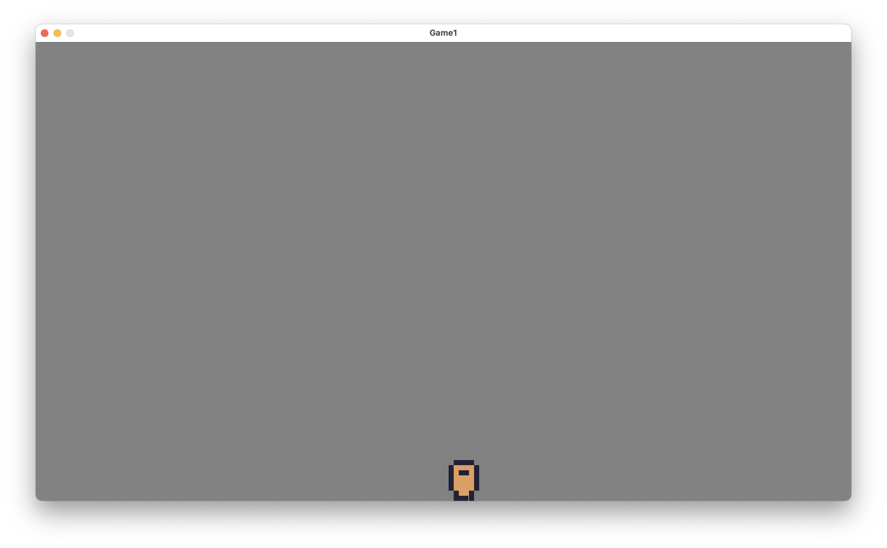

# Odin Game1
Odin Game1 is a living game I am developing as I learn Odin.  It will provide no real purpose other than provide a history of how I learn to program games in Odin.

# Why Odin?
I've been messing around with loads of game engines including GameMaker, Unity, Godot, Unreal... and never really found any of these stuck with me.

I've watch loads of content creators as they make games and recently I've been watching https://www.youtube.com/@randyprime as he coded a game in Odin.

# Skill level
Whislt I've been trying to program since I was kid in 1980's on a Commodore 64 I never really got anywhere.

You have been warned!

# Latest screenshot and video

